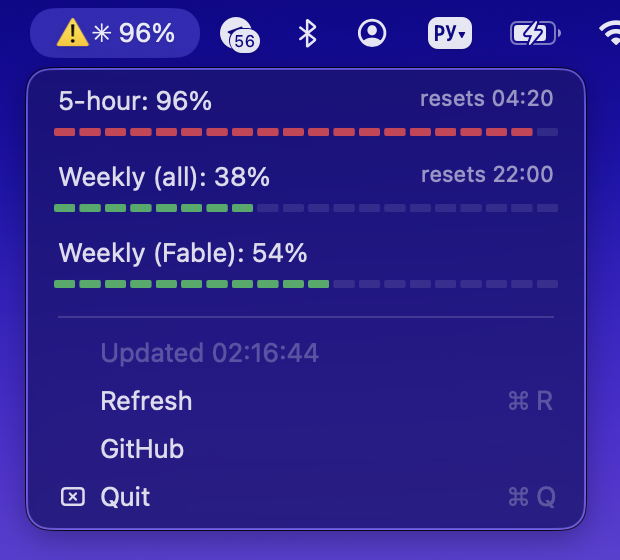

# Kvota — Claude limits in your menu bar

**Your Claude Code / Claude plan limits (5-hour and weekly), always visible in the macOS menu bar.**

Kvota shows the same numbers as `/usage` inside Claude Code — the 5-hour
session limit, the weekly limit, and the per-model weekly limit — as a
tiny native menu bar item that stays current without hammering the API.



`✳︎ 8%` sits in your menu bar; click it for all limits with reset times.
A ⚠️ appears when any limit crosses 90%.

## Why

If you use Claude Code on a subscription plan (Pro / Max), your real
constraint is not dollars — it's the rolling 5-hour and weekly limits.
Checking them means running `/usage` inside a session. Kvota puts them
where your eyes already are.

- **Native.** A single small Swift/AppKit file, no Electron, no Python.
  Universal binary (Apple Silicon + Intel), ~0% CPU idle, a few MB of RAM.
- **Zero setup.** No API keys to paste. It reads the OAuth token Claude
  Code already stores in your login Keychain.
- **Free to run.** It polls Anthropic's usage endpoint — the same one
  `/usage` uses. This is a billing metadata endpoint: **checking your
  limits does not consume any tokens or quota.**
- **Private.** Talks only to `api.anthropic.com`. No telemetry, no
  third-party servers, nothing is stored.

## Install

Requires macOS 12+ and [Claude Code](https://claude.com/claude-code)
(logged in at least once).

```bash
git clone https://github.com/vaskhan/claude-kvota.git
cd claude-kvota
make install
```

That's it — `✳︎` appears in your menu bar and starts at login from now on.

To remove:

```bash
make uninstall
```

## How it works

1. Reads Claude Code's OAuth token from the macOS Keychain
   (`security find-generic-password -s "Claude Code-credentials"`).
2. Calls `GET https://api.anthropic.com/api/oauth/usage` every 5 minutes
   in the background, and on every menu open (throttled to one request
   per 15 seconds). On HTTP 429 it backs off for as long as the server
   asks. Background interval is configurable (seconds, min 60):
   `defaults write ru.khanin.kvota interval -int 120`.
3. Renders the three limits with reset times, converted to your timezone.

Token refresh is handled by Claude Code itself; if the token expires,
Kvota shows a hint and recovers as soon as you open Claude Code again.

## FAQ

**Does polling waste my quota?** No. The usage endpoint returns
pre-computed counters — no model inference is involved. It's like
checking your balance: the check itself costs nothing.

**Russian interface?** Kvota speaks English and switches to Russian
automatically when macOS language is Russian.

**Windows/Linux?** No — Kvota is intentionally a native macOS app.

**Is this an official API?** No. It's the same private endpoint the
`/usage` command inside Claude Code uses. Anthropic may change or
restrict it at any time; if that happens Kvota will show an error, not
wrong numbers.

**Keychain prompts?** Normally none: Claude Code creates its Keychain
item via the `security` CLI, so Kvota's read through the same CLI is
covered by the existing ACL. If your setup differs and macOS shows a
password prompt, click "Always Allow" for /usr/bin/security or just
quit Kvota.

## Security notes

- The token is read into memory only for the duration of a request,
  never written to disk, never logged, never put in a URL.
- Only outbound connection: `https://api.anthropic.com` (ATS enforced).
- The build is ad-hoc signed by `make`. If you're distributing to other
  machines, sign with your own Developer ID and notarize.

## License

MIT
